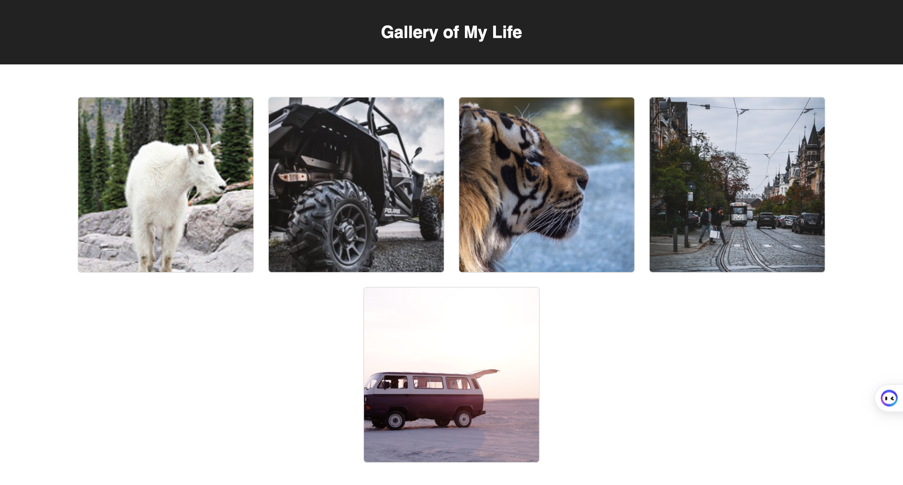

React-Gallery

This project aims to provide a visually appealing and user-friendly gallery application that showcases a variety of images. The application solves the problem of organizing and displaying images in an easily navigable interface. The solution was built using modern web technologies, incorporating responsive design and smooth interactions to create an enjoyable user experience.
The gallery application displays a collection of images, allowing users to browse through them in a visually appealing manner.

Screen Shot:

Installation:

To get this project up and running, follow these steps:
Clone the repository to your local machine.
Navigate to the project folder and run npm install to install dependencies.
In your terminal, run npm run server to start the server.
In another terminal, run npm run client to start the client-side application. This command will automatically open a new browser tab.

Usage:
To use the application, follow these steps:

Browse through the image gallery by scrolling or using the navigation buttons.
Click on an image to view the description.
Click on the "like" button to like a picture.

Built With:

React
CSS
JavaScript

Acknowledgement
Special thanks to Prime Digital Academy for providing the knowledge, support, and resources needed to make this application a reality. I would also like to extend my gratitude to my fellow cohort members for their invaluable feedback and encouragement.

Support
If you have suggestions or issues, please email me at cory.anderson6@yahoo.com